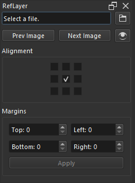

# RefLayer

Easily reference images from image folders in a Krita layer. Select an image in a folder to get started. The next and previous buttons will update the image in the layer to the next or previous image from the folder. If the image is too big for the canvas, it will automatically be resized to fit inside of the canvas plus some margin. The margin sizes are configurable. The image's alignment within the canvas is configurable. Three keybindable actions are included: next image, previous image, and toggle visibility.

I made this because I wanted to be able to draw right on top of my reference images. This is especially helpful for checking proportions during quick drawing exercises. Aside from drawing exercises, other usecases I have thought of include reviewing and annotating a bunch of drawings for nonexercise purposes, perhaps for a class, and hosting slideshows for demonstration purposes.

